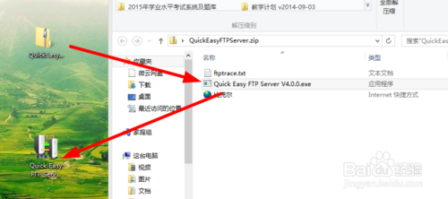
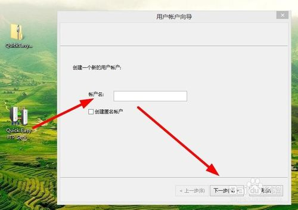
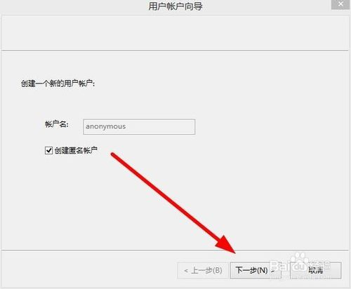
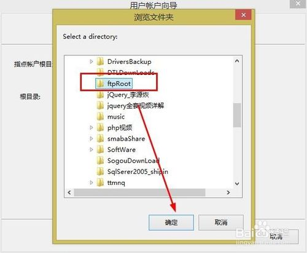
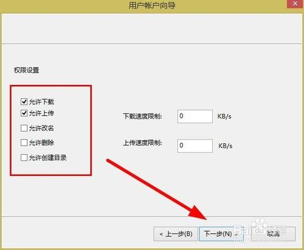
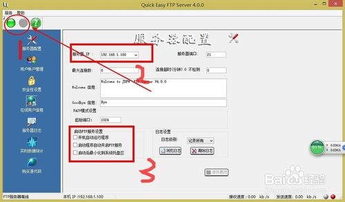
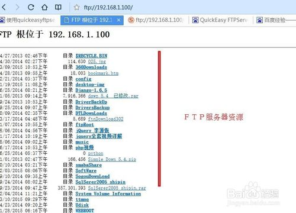

# 搭建自己的ftp服务器

## 工具/原料

* 软件：quickeasyftpserver
* 系统：windows

## 方法/步骤

1. 下载后解压文件到桌面，如下图：

2. 点击运行QuickEasy FTPServer.exe文件，文件为绿色版程序，不但体积小，而且也不需要安装，启动后如下图：

​

3. 勾选匿名账户建立匿名账号，如果不需要匿名，输入账户名即可。点击下一步。入选图：

​

4.在D盘建立一个FTPRoot文件夹作为FTP服务器根目录，如下图：

​

5. 在弹出的对话框中选择用户权限，点击完成按钮，如下图：

​

6. 完成后ftp服务器快速启动，启动后点左上角绿色按钮启动服务器，如下图：

​

7. 可以看到ＦＴＰ服务器地址为：192.168.1.100，记住IP地值，在浏览器地址栏输入FTP://192.168.1.100，即可访问资源．如下图：

